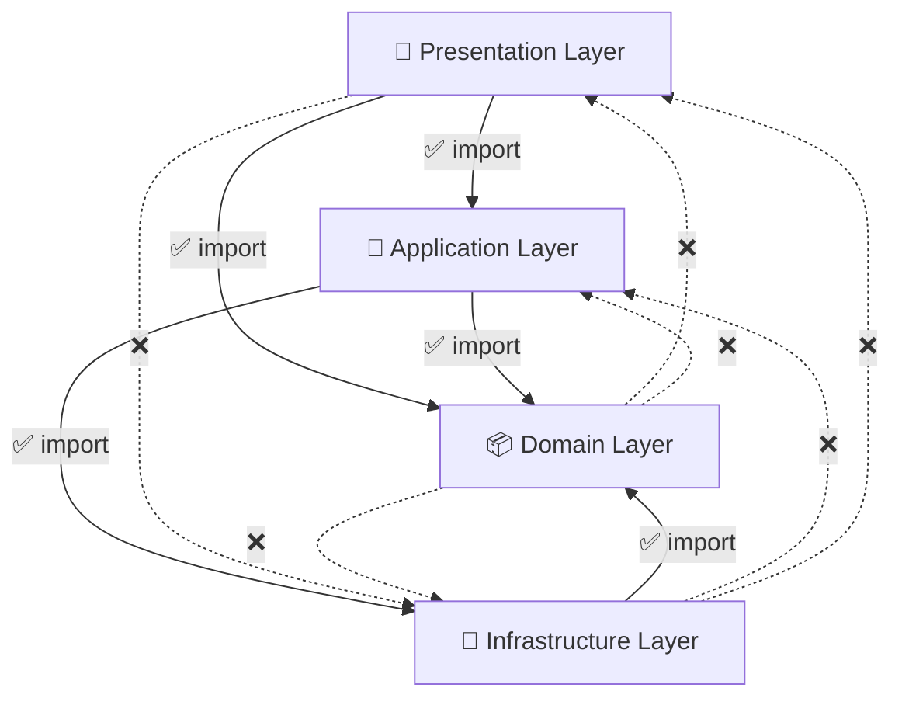
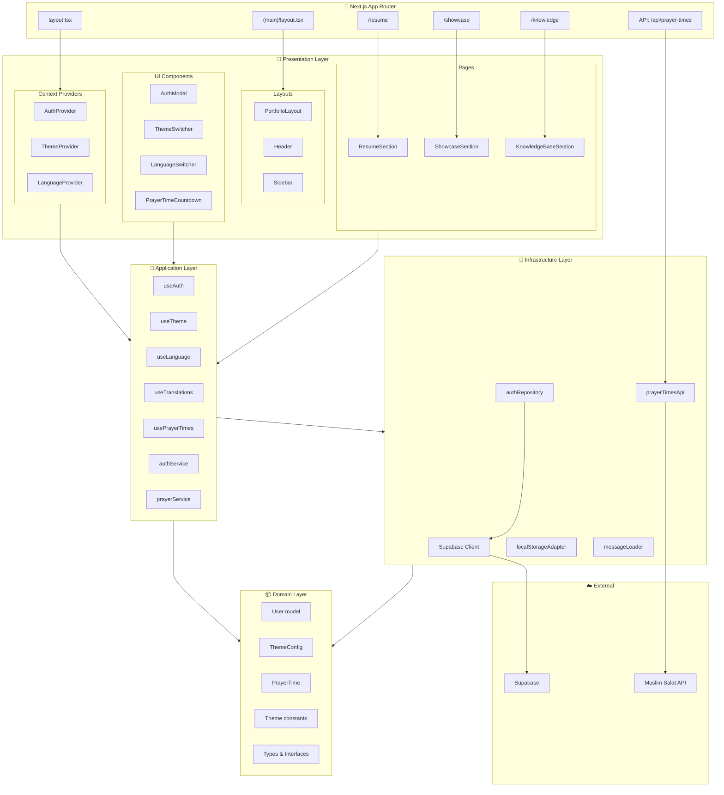
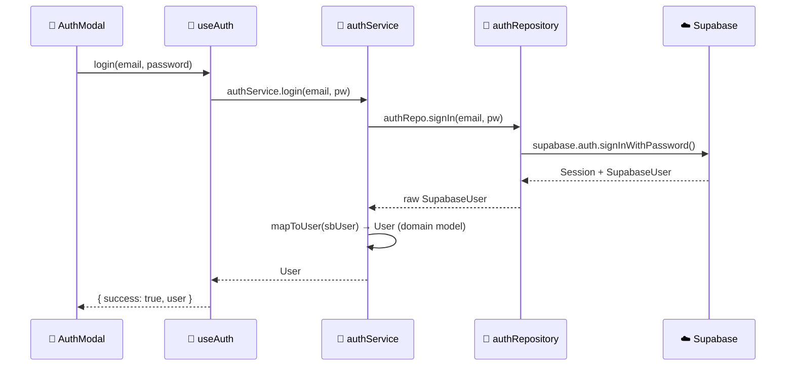
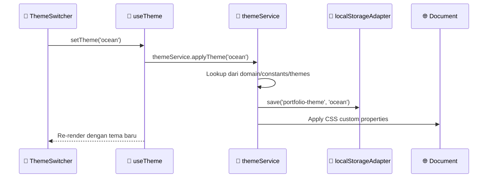
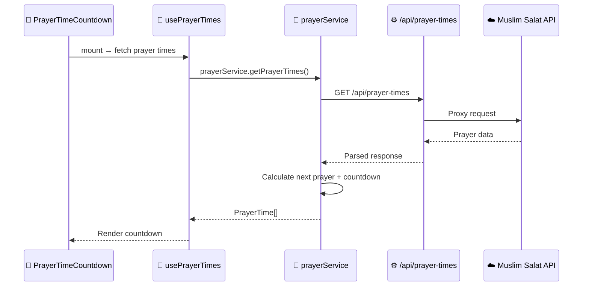
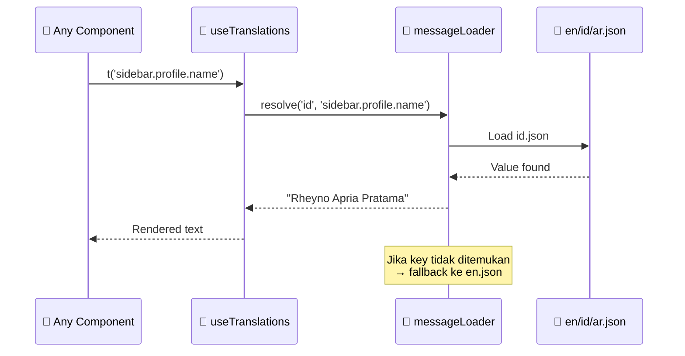
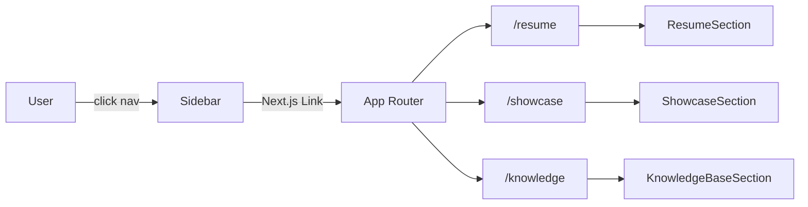
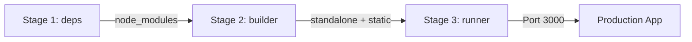

# 🏗️ Architecture — My Portfolio

> Dokumentasi arsitektur project portfolio **Rheyno Apria Pratama**, menggunakan **Layered Architecture** di atas **Next.js 14** (App Router) + **TypeScript** + **TailwindCSS** + **Supabase**.

---

## Arsitektur: Layered Architecture

Project ini menggunakan **Layered Architecture** (4 layers), di mana **setiap layer hanya boleh mengakses layer di bawahnya**:

```
┌─────────────────────────────────────────────────┐
│  📱 PRESENTATION LAYER                          │
│  UI components, layouts, pages, providers       │
├─────────────────────────────────────────────────┤
│  🧠 APPLICATION LAYER                           │
│  Hooks, services, use cases, business logic     │
├─────────────────────────────────────────────────┤
│  📦 DOMAIN LAYER                                │
│  Models, types, interfaces, constants           │
├─────────────────────────────────────────────────┤
│  🔌 INFRASTRUCTURE LAYER                        │
│  Supabase, external API, localStorage, i18n     │
└─────────────────────────────────────────────────┘
```

### Dependency Rules



| Layer | Boleh Import | Tidak Boleh Import |
|-------|-------------|-------------------|
| **Presentation** | Application, Domain | Infrastructure |
| **Application** | Domain, Infrastructure | Presentation |
| **Domain** | Tidak ada (independent) | Semua layer |
| **Infrastructure** | Domain | Application, Presentation |

> **Domain Layer** adalah inti — tidak bergantung pada siapapun. Semua layer lain bergantung padanya.

---

## Tech Stack

| Layer | Teknologi |
|-------|-----------|
| Framework | Next.js 14 (App Router) |
| Language | TypeScript |
| Styling | TailwindCSS 3 + CSS Custom Properties |
| Authentication | Supabase Auth |
| Icons | Lucide React + React Icons |
| Internationalization | Custom i18n (JSON-based) |
| Utility | clsx |
| Deployment | Docker (multi-stage build) + Standalone output |

---

## Struktur Direktori

```
my-portfolio/
│
├── app/                              # Next.js App Router (entry points)
│   ├── layout.tsx                    # Root layout → providers wrapper
│   ├── globals.css                   # Global styles + CSS variables
│   ├── (main)/                       # Route group — shared layout
│   │   ├── layout.tsx                # Sidebar + Header layout
│   │   ├── resume/page.tsx           # /resume
│   │   ├── showcase/page.tsx         # /showcase
│   │   └── knowledge/page.tsx        # /knowledge
│   └── api/                          # API Routes (server-side)
│       └── prayer-times/route.ts
│
├── presentation/                     # 📱 PRESENTATION LAYER
│   ├── layouts/
│   │   ├── PortfolioLayout.tsx       # Main layout shell
│   │   ├── Header.tsx                # Top navigation bar
│   │   └── Sidebar.tsx               # Side navigation + profile
│   ├── pages/
│   │   ├── ResumeSection.tsx         # Resume/CV content
│   │   ├── ShowcaseSection.tsx       # Project showcase
│   │   └── KnowledgeBaseSection.tsx  # Knowledge base / articles
│   ├── components/                   # Reusable UI (pure presentation)
│   │   ├── AnimatedGreeting.tsx
│   │   ├── AuthModal.tsx
│   │   ├── EditableText.tsx
│   │   ├── LanguageSwitcher.tsx
│   │   ├── PrayerTimeCountdown.tsx
│   │   ├── ThemeSwitcher.tsx
│   │   └── ThemeToggle.tsx
│   └── providers/                    # React Context Providers
│       ├── AuthProvider.tsx          # Auth state provider
│       ├── ThemeProvider.tsx         # Theme state + CSS vars
│       └── LanguageProvider.tsx      # Language state + RTL
│
├── application/                      # 🧠 APPLICATION LAYER
│   ├── hooks/
│   │   ├── useAuth.ts                # Auth logic (login/signup/logout)
│   │   ├── useTheme.ts              # Theme switching logic
│   │   ├── useLanguage.ts           # Language switching logic
│   │   ├── useTranslations.ts       # Translation lookup
│   │   └── usePrayerTimes.ts        # Prayer time fetch + countdown
│   └── services/
│       ├── authService.ts            # Orchestrate auth operations
│       ├── themeService.ts           # Theme application logic
│       └── prayerService.ts          # Prayer time data processing
│
├── domain/                           # 📦 DOMAIN LAYER
│   ├── models/
│   │   ├── User.ts                   # User interface, roles
│   │   ├── Theme.ts                  # ThemeConfig, ThemeTemplate
│   │   └── Prayer.ts                # PrayerTime types
│   ├── constants/
│   │   ├── themes.ts                 # 4 theme config objects
│   │   └── languages.ts             # Supported languages list
│   └── types/
│       └── index.ts                  # SectionType, Language, etc.
│
├── infrastructure/                   # 🔌 INFRASTRUCTURE LAYER
│   ├── supabase/
│   │   ├── client.ts                 # Supabase client instance
│   │   └── authRepository.ts        # Supabase auth operations
│   ├── api/
│   │   └── prayerTimesApi.ts        # External API calls
│   ├── storage/
│   │   └── localStorageAdapter.ts   # localStorage get/set helpers
│   └── i18n/
│       ├── messageLoader.ts         # Load & resolve translations
│       └── messages/
│           ├── en.json
│           ├── id.json
│           └── ar.json
│
├── public/                           # Static assets
│   ├── favicon.svg
│   └── assets/
│
├── Design.json                       # Design system specification
├── Dockerfile                        # Multi-stage Docker build
├── docker-compose.yml
├── tailwind.config.js
├── next.config.js
├── tsconfig.json
└── package.json
```

---

## Diagram Arsitektur



---

## Detail Per Layer

### 📱 Presentation Layer

Layer ini **hanya bertanggung jawab pada tampilan** — tidak boleh ada business logic atau akses langsung ke external service.

| Folder | Isi | Aturan |
|--------|-----|--------|
| `layouts/` | PortfolioLayout, Header, Sidebar | Mengelola layout visual saja |
| `pages/` | ResumeSection, ShowcaseSection, KnowledgeBaseSection | Render konten per route |
| `components/` | AuthModal, ThemeSwitcher, dll. | Pure UI, terima data via props/hooks |
| `providers/` | AuthProvider, ThemeProvider, LanguageProvider | Bridge antara Application layer dan React component tree |

**Aturan Presentation:**
- ✅ Import dari `application/` (hooks, services)
- ✅ Import dari `domain/` (types, models)
- ❌ TIDAK boleh import dari `infrastructure/` (tidak boleh akses Supabase langsung, localStorage langsung, dll.)

---

### 🧠 Application Layer

Layer ini berisi **business logic dan use cases** — mengorkestrasikan operasi antar layer.

| Folder | Isi | Tanggung Jawab |
|--------|-----|----------------|
| `hooks/` | useAuth, useTheme, useLanguage, useTranslations, usePrayerTimes | React hooks sebagai interface ke UI |
| `services/` | authService, themeService, prayerService | Pure logic, bisa di-unit test tanpa React |

**Contoh alur — `useAuth` hook:**
```
useAuth (hook)
  → authService.login(email, pw)      # application/services
    → authRepo.signIn(email, pw)       # infrastructure/supabase
      → supabase.auth.signInWithPassword()  # external
    → mapToUser(sbUser)                # menggunakan domain/models/User
  → return User
```

---

### 📦 Domain Layer

Layer **paling independen** — hanya berisi definisi data, tidak bergantung pada framework atau library manapun.

| Folder | Isi |
|--------|-----|
| `models/` | `User` (id, email, name, role), `ThemeConfig` (colors, gradients, shadows), `PrayerTime` |
| `constants/` | 4 theme configs, supported languages list |
| `types/` | `SectionType`, `Language`, `ThemeTemplate`, dll. |

**Contoh — `domain/models/User.ts`:**
```typescript
export interface User {
  id: string
  email: string
  name: string
  role: 'admin' | 'user'
}
```

**Contoh — `domain/constants/themes.ts`:**
```typescript
import { ThemeConfig } from '../models/Theme'

export const themeConfigs: Record<string, ThemeConfig> = {
  default: { name: 'default', displayName: 'Classic', colors: { ... }, darkColors: { ... } },
  ocean: { ... },
  forest: { ... },
  sunset: { ... },
}
```

---

### 🔌 Infrastructure Layer

Layer ini menangani **semua komunikasi dengan dunia luar** — database, API, storage, file system.

| Folder | Isi | Tanggung Jawab |
|--------|-----|----------------|
| `supabase/` | client.ts, authRepository.ts | Semua interaksi Supabase |
| `api/` | prayerTimesApi.ts | HTTP calls ke external API |
| `storage/` | localStorageAdapter.ts | Read/write localStorage |
| `i18n/` | messageLoader.ts + messages/*.json | Load & resolve translations |

**Mengapa dipisah?** Jika suatu hari ingin pindah dari Supabase ke Firebase, **hanya folder `infrastructure/supabase/` yang perlu diubah** — tidak ada kode lain yang terpengaruh.

---

## Alur Data per Fitur

### 🔐 Login Flow



### 🎨 Theme Switch Flow



### 🕌 Prayer Times Flow



### 🌐 Translation Flow



---

## Pola Navigasi (URL-Based Routing)

Menggunakan Next.js **App Router route groups** untuk URL-based navigation:

```
app/(main)/
├── layout.tsx          → Shared: Sidebar + Header
├── resume/page.tsx     → URL: /resume
├── showcase/page.tsx   → URL: /showcase
└── knowledge/page.tsx  → URL: /knowledge
```



✅ URL berubah, browser back/forward bekerja, SEO-friendly, bisa di-bookmark.

---

## Sistem Tema (Multi-Theme)

Mendukung **4 tema warna** × **2 mode** (light/dark) = **8 variasi**:

| Tema | Deskripsi |
|------|-----------|
| `default` (Classic) | Biru profesional |
| `ocean` (Ocean Breeze) | Biru laut menenangkan |
| `forest` (Forest Green) | Hijau natural |
| `sunset` (Sunset Glow) | Oranye hangat |

**Mekanisme (di layered architecture):**
1. **Domain**: Theme config objects disimpan di `domain/constants/themes.ts`
2. **Infrastructure**: `localStorageAdapter` menyimpan preferensi user
3. **Application**: `themeService` apply CSS custom properties ke DOM
4. **Presentation**: `ThemeProvider` expose state ke component tree

---

## Internasionalisasi (i18n)

| Bahasa | File | Direction |
|--------|------|-----------|
| English | `en.json` | LTR |
| Bahasa Indonesia | `id.json` | LTR |
| Arabic | `ar.json` | RTL |

**Mekanisme (di layered architecture):**
1. **Infrastructure**: `messageLoader` loads JSON files dan resolve key dengan dot-notation
2. **Application**: `useTranslations` hook expose `t()` function
3. **Presentation**: Components call `t('key.path')` untuk rendering

---

## Deployment

### Docker (Multi-stage Build)



| Config | Value |
|--------|-------|
| Base image | `node:18-alpine` |
| Output mode | `standalone` |
| Port | 3000 |
| User | Non-root (`nextjs:nodejs`) |

### Environment Variables

| Variable | Layer | Deskripsi |
|----------|-------|-----------|
| `NEXT_PUBLIC_SUPABASE_URL` | Infrastructure | Supabase project URL |
| `NEXT_PUBLIC_SUPABASE_ANON_KEY` | Infrastructure | Supabase anonymous key |
| `NEXT_PUBLIC_ADMIN_EMAIL` | Domain | Email untuk role admin |
| `RAPIDAPI_KEY` | Infrastructure | API key untuk prayer times (server-only) |

---

## Keuntungan Layered Architecture

| Aspek | Penjelasan |
|-------|------------|
| **Separation of Concerns** | Setiap layer punya tanggung jawab jelas |
| **Testability** | Service & Repository bisa di-unit test tanpa React |
| **Maintainability** | Perubahan di satu layer tidak merusak layer lain |
| **Replaceability** | Ganti Supabase → Firebase? Hanya ubah `infrastructure/supabase/` |
| **Scalability** | Tambah fitur baru cukup tambah di setiap layer tanpa chaos |
| **Readability** | Developer baru langsung paham "kode ini di mana" |
