# 📋 Architecture Refactor Plan — Layered Architecture

> Rencana implementasi refactor dari arsitektur saat ini (Component-Based SPA) ke **Layered Architecture** (4 layers).

---

## Overview

Refactor project portfolio dari struktur flat (components/contexts/hooks) menjadi **Layered Architecture** dengan 4 layer terpisah, serta migrasi navigasi dari `useState` ke **URL-based routing**.

---

## Phase 1: Domain Layer (Foundation)

> Buat layer paling dasar — types, models, dan constants.

### Tasks:

#### [NEW] `domain/models/User.ts`
- Extract `User` interface dari `AuthContext.tsx` (line 7-12)
- Extract `AuthContextType` interface

#### [NEW] `domain/models/Theme.ts`
- Extract `ThemeConfig`, `ThemeTemplate` dari `ThemeContext.tsx` (line 5-47)

#### [NEW] `domain/models/Prayer.ts`
- Definisikan `PrayerTime` interface dari data yang dipakai di `PrayerTimeCountdown.tsx`

#### [NEW] `domain/constants/themes.ts`
- Pindahkan 4 theme config objects dari `ThemeContext.tsx` (line 58-223, ~165 baris)
- Pure data, tidak ada logic

#### [NEW] `domain/constants/languages.ts`
- Definisikan `Language` type dan supported languages
- Extract dari `LanguageContext.tsx` (line 5)

#### [NEW] `domain/types/index.ts`
- `SectionType` dari `PortfolioLayout.tsx` (line 11)
- Re-export semua types dari models

---

## Phase 2: Infrastructure Layer

> Isolasi semua interaksi dengan external services.

### Tasks:

#### [MOVE] `infrastructure/supabase/client.ts`
- Pindahkan dari `lib/supabase.ts` → tidak ada perubahan logic

#### [NEW] `infrastructure/supabase/authRepository.ts`
- Extract Supabase auth operations dari `AuthContext.tsx`:
  - `signIn(email, password)` → wrap `supabase.auth.signInWithPassword()`
  - `signUp(name, email, password)` → wrap `supabase.auth.signUp()`
  - `signOut()` → wrap `supabase.auth.signOut()`
  - `getSession()` → wrap `supabase.auth.getSession()`
  - `onAuthStateChange(callback)` → wrap listener

#### [NEW] `infrastructure/api/prayerTimesApi.ts`
- Extract fetch logic dari `PrayerTimeCountdown.tsx`
- Function: `fetchPrayerTimes(): Promise<PrayerTimeResponse>`

#### [NEW] `infrastructure/storage/localStorageAdapter.ts`
- Generic helper: `get<T>(key)`, `set<T>(key, value)`
- Replace langsung `localStorage.getItem/setItem` di ThemeContext dan LanguageContext

#### [MOVE] `infrastructure/i18n/messages/`
- Pindahkan `messages/*.json` → `infrastructure/i18n/messages/`

#### [NEW] `infrastructure/i18n/messageLoader.ts`
- Extract translation loading & resolving logic dari `useTranslations.ts` (line 19-44)
- Function: `resolveTranslation(lang, key): string`

#### [MODIFY] `app/api/prayer-times/route.ts`
- Pindahkan hardcoded API key ke env var `RAPIDAPI_KEY`
- Import fetch logic dari `infrastructure/api/prayerTimesApi.ts`

---

## Phase 3: Application Layer

> Business logic dan hooks — orchestrator antara Infrastructure dan Presentation.

### Tasks:

#### [NEW] `application/services/authService.ts`
- `login(email, pw)`: call authRepo → map ke domain User
- `signup(name, email, pw)`: call authRepo → handle edge cases
- `logout()`: call authRepo.signOut()
- `mapSupabaseUser(sbUser): User`: mapping logic dari `AuthContext.tsx` (line 32-39)
- Tidak bergantung pada React

#### [NEW] `application/services/themeService.ts`
- `applyTheme(theme, isDark)`: apply CSS custom properties
- `getThemeConfig(theme)`: lookup dari domain constants
- Logic dari `ThemeContext.tsx` (line 242-267)

#### [NEW] `application/services/prayerService.ts`
- `getPrayerTimes()`: fetch via infrastructure API
- `calculateNextPrayer(times)`: countdown logic

#### [MODIFY] `application/hooks/useAuth.ts`
- Refactor: consume `authService` instead of direct Supabase calls
- Expose: `user`, `isAuthenticated`, `login()`, `signup()`, `logout()`, `isEditMode`

#### [MODIFY] `application/hooks/useTheme.ts`
- Refactor: consume `themeService` + `localStorageAdapter`
- Expose: `currentTheme`, `setTheme()`, `isDark`, `toggleDarkMode()`

#### [MODIFY] `application/hooks/useLanguage.ts`
- Refactor: consume `localStorageAdapter`
- Expose: `language`, `setLanguage()`, `direction`

#### [MODIFY] `application/hooks/useTranslations.ts`
- Refactor: consume `messageLoader` dari infrastructure
- Expose: `t()`, `language`

#### [NEW] `application/hooks/usePrayerTimes.ts`
- Extract prayer time logic dari `PrayerTimeCountdown.tsx`
- Consume `prayerService`

---

## Phase 4: Presentation Layer

> Refactor components agar hanya concern dengan UI.

### Tasks:

#### [MOVE] `presentation/layouts/`
- Pindahkan `PortfolioLayout.tsx`, `Header.tsx`, `Sidebar.tsx`
- Refactor import paths

#### [MOVE] `presentation/pages/`
- Pindahkan `ResumeSection.tsx`, `ShowcaseSection.tsx`, `KnowledgeBaseSection.tsx`

#### [MOVE] `presentation/components/`
- Pindahkan semua `components/ui/*`
- Refactor: hapus direct infrastructure access (localStorage, Supabase)
- Consume hooks dari `application/hooks/`

#### [NEW] `presentation/providers/AuthProvider.tsx`
- Thin wrapper: create React Context, delegate logic ke `useAuth` hook
- Jauh lebih pendek dari AuthContext.tsx saat ini

#### [NEW] `presentation/providers/ThemeProvider.tsx`
- Thin wrapper: create React Context, delegate logic ke `useTheme` hook

#### [NEW] `presentation/providers/LanguageProvider.tsx`
- Thin wrapper: create React Context, delegate logic ke `useLanguage` hook

---

## Phase 5: URL-Based Routing

> Migrasi dari `useState` section switching ke Next.js App Router.

### Tasks:

#### [NEW] `app/(main)/layout.tsx`
- Shared layout: Sidebar + Header
- Replace `PortfolioLayout` state-based navigation

#### [NEW] `app/(main)/resume/page.tsx`
- Import dan render `ResumeSection`

#### [NEW] `app/(main)/showcase/page.tsx`
- Import dan render `ShowcaseSection`

#### [NEW] `app/(main)/knowledge/page.tsx`
- Import dan render `KnowledgeBaseSection`

#### [MODIFY] `app/page.tsx`
- Redirect ke `/resume` (default route)

#### [MODIFY] `presentation/layouts/Sidebar.tsx`
- Ganti `onClick → onSectionChange()` dengan `<Link href="/resume">`, dll.

---

## Phase 6: Cleanup

#### [DELETE] `contexts/AuthContext.tsx` → digantikan `presentation/providers/` + `application/hooks/`
#### [DELETE] `contexts/ThemeContext.tsx` → digantikan
#### [DELETE] `contexts/LanguageContext.tsx` → digantikan
#### [DELETE] `hooks/useTranslations.ts` → pindah ke `application/hooks/`
#### [DELETE] `lib/supabase.ts` → pindah ke `infrastructure/supabase/client.ts`
#### [DELETE] `messages/` → pindah ke `infrastructure/i18n/messages/`

#### [MODIFY] `tsconfig.json`
- Tambah path aliases baru:
```json
{
  "paths": {
    "@/*": ["./*"],
    "@presentation/*": ["./presentation/*"],
    "@application/*": ["./application/*"],
    "@domain/*": ["./domain/*"],
    "@infrastructure/*": ["./infrastructure/*"]
  }
}
```

#### [MODIFY] `tailwind.config.js`
- Tambah `presentation/` ke content paths

---

## Urutan Eksekusi

```mermaid
gantt
    title Refactor Execution Order
    dateFormat X
    axisFormat %s

    section Phase 1
    Domain Layer (types, models, constants)     :p1, 0, 1

    section Phase 2
    Infrastructure Layer (repos, adapters)      :p2, after p1, 1

    section Phase 3
    Application Layer (services, hooks)         :p3, after p2, 1

    section Phase 4
    Presentation Layer (refactor components)    :p4, after p3, 1

    section Phase 5
    URL-Based Routing                           :p5, after p4, 1

    section Phase 6
    Cleanup old files & config                  :p6, after p5, 1
```



> ⚠️ **Setiap phase harus selesai dan terverifikasi sebelum lanjut ke phase berikutnya.** Domain Layer harus ada dulu karena semua layer lain bergantung padanya.

---

## Verification Plan

### Automated
- `npm run build` — pastikan no TypeScript errors setelah setiap phase
- `npm run lint` — pastikan no linting issues

### Manual
- Jalankan `npm run dev` setelah setiap phase
- Verifikasi:
  1. ✅ Halaman tampil normal (tidak ada blank screen)
  2. ✅ Theme switching bekerja (4 tema + dark mode)
  3. ✅ Language switching bekerja (EN/ID/AR + RTL)
  4. ✅ Login/Signup bekerja via Supabase
  5. ✅ Prayer time countdown muncul
  6. ✅ Navigasi antar section bekerja via URL (Phase 5+)
  7. ✅ Browser back/forward bekerja (Phase 5+)

---

## Estimasi

| Phase | Effort | Files Terdampak |
|-------|--------|-----------------|
| 1. Domain | 🟢 Rendah | ~6 file baru |
| 2. Infrastructure | 🟡 Sedang | ~6 file baru, 1 modify |
| 3. Application | 🟡 Sedang | ~8 file baru/modify |
| 4. Presentation | 🔴 Tinggi | ~13 file move/refactor |
| 5. URL Routing | 🟡 Sedang | ~5 file baru/modify |
| 6. Cleanup | 🟢 Rendah | ~8 file delete, 2 modify |
